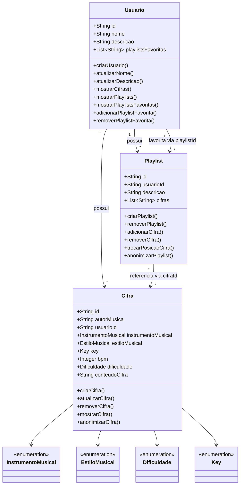

# API de Repositório de Cifras Musicais

## 1. Visão geral

A **API de Repositório de Cifras Musicais** é uma API RESTful para gerenciamento e organização de cifras musicais. A plataforma permite que usuários criem, editem e removam suas próprias cifras, criem playlists contendo cifras próprias ou de outros usuários e mantenham uma lista pessoal de playlists favoritas para acesso rápido.

O domínio é organizado em três entidades principais:

- **Usuário** — representa o proprietário das cifras e playlists e mantém suas playlists favoritas.
- **Cifra** — representa uma cifra musical, vinculada a um único usuário.
- **Playlist** — representa uma coleção ordenada de cifras, pertencente a um único usuário.

### Escopo

O projeto contempla:

- cadastro e atualização de usuários;
- criação, consulta, atualização e remoção de cifras;
- criação e remoção de playlists;
- inclusão, remoção e reordenação de cifras em playlists;
- associação e remoção de playlists favoritas;
- consulta das cifras e playlists de um usuário;
- anonimização das cifras e playlists quando um usuário é removido.

Não fazem parte do escopo descrito nos requisitos fornecidos funcionalidades como autenticação/autorização, upload de arquivos, reprodução de áudio, busca textual avançada ou interface web.

## 2. Stack e dependências

| Tecnologia | Finalidade |
|---|---|
| Java 21 | Linguagem e runtime da aplicação |
| Spring Boot 4 | Framework principal da API REST |
| MongoDB | Banco de dados NoSQL e persistência |
| JUnit 6 | Testes automatizados |
| Mockito 5 | Isolamento e simulação de dependências nos testes |

A stack de testes definida utiliza **JUnit + Mockito** para testes unitários e **Spring Boot Test + MongoDB** para testes de integração.

### Modelo de dados

#### Usuário

| Campo | Tipo/Regra |
|---|---|
| `id` | Único, obrigatório |
| `nome` | Texto, único e obrigatório |
| `descrição` | Texto, opcional |
| `playlistsFavoritas` | Lista de `playlistId` |

#### Cifra

| Campo | Tipo/Regra |
|---|---|
| `id` | Único, obrigatório |
| `autorMusica` | Texto, opcional |
| `usuarioId` | Identificador do usuário, obrigatório |
| `instrumentoMusical` | Texto, obrigatório |
| `estiloMusical` | Texto, obrigatório |
| `key` | Texto, obrigatório |
| `bpm` | Numérico, opcional; deve ser positivo |
| `dificuldade` | Texto, obrigatório |
| `conteudoCifra` | Texto, obrigatório |

#### Playlist

| Campo | Tipo/Regra |
|---|---|
| `id` | Único, obrigatório |
| `usuarioId` | Identificador do proprietário, obrigatório |
| `descrição` | Texto, opcional |
| `cifras` | Lista de `cifraId` |

Os campos `instrumentoMusical`, `dificuldade`, `key` e `estiloMusical` são representados por enums. fileciteturn0file1L29-L29

## 3. Regras de domínio

1. Cada cifra deve estar vinculada a **um único usuário**, tanto na criação quanto na atualização.
2. Cada playlist deve estar vinculada a **um único usuário**, tanto na criação quanto na atualização.
3. Uma playlist deve possuir **ao menos uma cifra** no momento da criação.
4. Quando um usuário é removido, suas cifras e playlists não são simplesmente descartadas: o `usuarioId` desses recursos deve ser alterado para um **usuário anônimo único**, responsável exclusivamente pela anonimização.
5. O BPM deve respeitar a validação definida pelo projeto; no plano de testes, a faixa considerada válida é de **30 a 300 BPM**.

As quatro primeiras regras estão explicitamente definidas na especificação do domínio. fileciteturn0file1L31-L35

## 4. Casos de uso

### Usuário

- **Criar usuário** — cadastra um usuário com nome único.
- **Atualizar nome** — altera o nome de um usuário existente.
- **Atualizar descrição** — altera a descrição de um usuário.
- **Mostrar cifras** — retorna somente as cifras vinculadas ao usuário.
- **Mostrar playlists** — retorna somente as playlists pertencentes ao usuário.
- **Mostrar playlists favoritas** — retorna as playlists cujos IDs estão na lista de favoritos.
- **Adicionar playlist aos favoritos** — associa uma playlist à lista pessoal do usuário.
- **Remover playlist dos favoritos** — remove a associação de favorito.

### Cifra

- **Criar cifra** — cria uma cifra com os dados obrigatórios e proprietário definido.
- **Atualizar cifra** — atualiza uma cifra existente respeitando sua propriedade.
- **Remover cifra** — remove uma cifra.
- **Mostrar cifra** — consulta uma cifra.
- **Anonimizar cifra** — substitui o proprietário pelo usuário anônimo.

### Playlist

- **Criar playlist** — cria uma playlist vinculada a um único proprietário e contendo ao menos uma cifra.
- **Remover playlist** — remove uma playlist.
- **Adicionar cifra** — inclui uma cifra na playlist.
- **Remover cifra** — retira uma cifra da playlist.
- **Trocar posição de cifra** — altera a ordem das cifras.
- **Anonimizar playlist** — substitui o proprietário pelo usuário anônimo.

As operações acima correspondem às operações de domínio especificadas para as três entidades. fileciteturn0file1L37-L40

## 5. Arquitetura

A aplicação é uma **API RESTful** estruturada em camadas, com o Spring Boot responsável pela exposição dos recursos e pela integração entre as regras de negócio e a persistência no MongoDB. No contexto deste projeto, a camada de **Controllers** representa a porta de entrada das operações de usuário, cifra e playlist: recebe as requisições para criar, consultar, atualizar ou remover esses recursos e encaminha cada operação para a camada responsável pelo domínio. A camada de **Services/Use Cases** concentra a lógica específica do repositório de cifras: é nela que são tratadas as regras de propriedade de cifras e playlists, a exigência de pelo menos uma cifra em uma nova playlist, o gerenciamento das playlists favoritas e o processo de anonimização das cifras e playlists quando um usuário é removido. A camada de **Repositories** é responsável por realizar a persistência e recuperação das entidades no MongoDB, utilizando os identificadores que estabelecem as relações do domínio, como `usuarioId`, `cifraId` e `playlistId`. Por fim, o **MongoDB** mantém os dados de usuários, cifras e playlists, incluindo as listas de IDs utilizadas para representar favoritos e as cifras que compõem cada playlist.

```text
┌──────────────────────────────────────────────┐
│              API REST / Controllers          │
│ Usuários · Cifras · Playlists · Favoritos   │
└──────────────────────┬───────────────────────┘
                       │
                       ▼
┌──────────────────────────────────────────────┐
│             Services / Use Cases             │
│ Propriedade · Favoritos · Playlist ·         │
│ Validações · Anonimização                    │
└──────────────────────┬───────────────────────┘
                       │
                       ▼
┌──────────────────────────────────────────────┐
│                  Repositories                │
│ Persistência e consultas por IDs do domínio │
└──────────────────────┬───────────────────────┘
                       │
                       ▼
┌──────────────────────────────────────────────┐
│                    MongoDB                   │
│       Usuários · Cifras · Playlists          │
└──────────────────────────────────────────────┘
```

## 6. Diagrama de classes



### Observação sobre os relacionamentos

As relações entre as entidades são representadas por identificadores, conforme o modelo fornecido:

- `Cifra.usuarioId` identifica o proprietário da cifra.
- `Playlist.usuarioId` identifica o proprietário da playlist.
- `Playlist.cifras` contém os `cifraId` das cifras.
- `Usuario.playlistsFavoritas` contém os `playlistId` das playlists favoritas. fileciteturn0file1L5-L27

## 7. Estratégia de testes

A estratégia possui dois níveis principais:

### Testes unitários

Validam as operações isoladamente, principalmente services/use cases e regras de domínio. Devem cobrir operações de usuário, cifra e playlist, campos obrigatórios/opcionais, propriedade, quantidade mínima de cifras, validação de BPM e anonimização. fileciteturn0file0L104-L114

### Testes de integração

Validam o fluxo entre aplicação, repositories e MongoDB, incluindo persistência, relacionamentos entre entidades, alterações em listas de cifras e favoritos e anonimização após remoção de usuário. fileciteturn0file0L116-L123

O detalhamento completo dos casos de teste está em [`TEST_PLAN.md`](./TEST_PLAN.md).

## 8. Estrutura sugerida do repositório

```text
.
├── README.md
├── TEST_PLAN.md
├── pom.xml
└── src/
    ├── main/
    │   └── java/
    │       └── ...
    └── test/
        └── java/
            └── ...
```

> A estrutura de diretórios acima é uma organização sugerida para o repositório. Os arquivos fornecidos especificam a stack e o domínio, mas não fornecem a estrutura real de pacotes do projeto.

## 9. Execução e validação

Como os arquivos fornecidos não descrevem os comandos de build, execução ou configuração de ambiente, esses comandos devem ser adicionados ao README conforme o `pom.xml`/configuração efetiva do repositório.

Para a validação automatizada, a estratégia definida utiliza JUnit 6 e Mockito 5 nos testes unitários e Spring Boot Test com MongoDB nos testes de integração. fileciteturn0file0L125-L131
